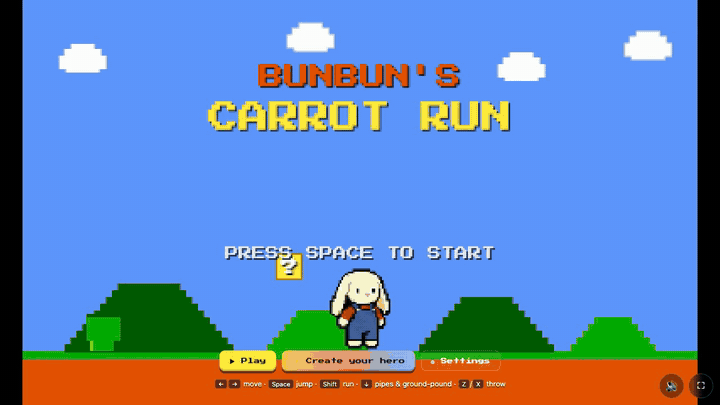
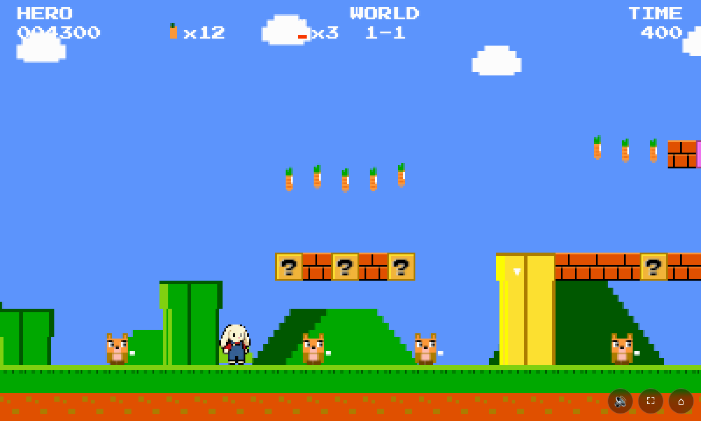
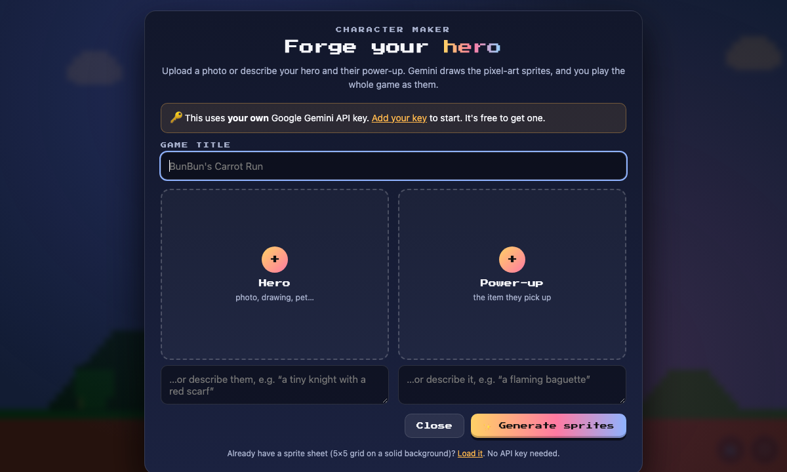

<div align="center">

# 🐰 BunBun’s Carrot Run 🥕

**A retro NES-style platformer where _you_ choose the hero.**
Play as BunBun, or use the Character Maker to turn a photo or a one-line description into a fully animated pixel-art hero and power-up. The sprites are drawn by Google Gemini using **your own API key**.

[](LICENSE)




</div>

## ✨ Features

- **Hub world and 3 worlds**, with pipes, underground areas, vines, checkpoints and a flagpole finish. Clear one world to unlock the next
- **Power-ups**: leek (throwable), Kumamon, Miku, a Yoshi ride, star power and 1-ups, each with its own BunBun outfit
- **Character Maker**: upload a photo (you, your pet, a drawing…) or just describe a hero and a power-up. Gemini draws a 5×5 sprite sheet (idle, walk, jump, powered-up and the item), and the game cuts it into frames so you play every level as your creation
- **Bring your own key**: there's no backend. The browser talks straight to Google with the player's own Gemini API key
- **Save and reload heroes**: download the generated sheet and load it later with no API key needed. Your last hero is remembered in the browser
- **Synthesized chiptune + SFX** made with the Web Audio API
- **Keyboard and touch controls**, fullscreen, mute, and saved world progress

<table>
  <tr>
    <td></td>
    <td></td>
  </tr>
  <tr>
    <td align="center"><sub>World 1-1</sub></td>
    <td align="center"><sub>Character Maker</sub></td>
  </tr>
</table>

## 🚀 Play it

It's a static site with no build step, but it uses ES modules, so serve it over HTTP instead of opening the file directly:

```bash
git clone https://github.com/Mattlo0546/bun-buns-carrot-run.git
cd bun-buns-carrot-run
python3 -m http.server 8000
```

Then open <http://localhost:8000>. Any static host works too (GitHub Pages, Netlify, Vercel, …).

## 🎮 Controls

| Action | Keyboard | Touch |
| --- | --- | --- |
| Move | <kbd>←</kbd> <kbd>→</kbd> | ◀ ▶ |
| Run | hold <kbd>Shift</kbd> | — |
| Jump (hold for higher) | <kbd>Space</kbd> / <kbd>↑</kbd> | A |
| Enter pipe · ground-pound (in the air) | <kbd>↓</kbd> | ▼ |
| Throw / use power | <kbd>Z</kbd> / <kbd>X</kbd> | B |
| Mute · Fullscreen | <kbd>M</kbd> · <kbd>F</kbd> | buttons |

## 🎨 Character Maker & your API key

1. Get a free Gemini API key from [Google AI Studio](https://aistudio.google.com/apikey).
2. In the game, open **⚙ Settings**, paste the key, and choose whether to remember it on this device.
3. Open **✨ Create your hero**. Add a photo or description for the hero and the power-up, then hit **Generate**.
4. Happy with the preview? **▶ Play as this hero**. If not, **🎲 Re-roll**.

**Where your key goes:** only to `generativelanguage.googleapis.com`, sent directly from your browser. It's held in memory, or in your browser's `localStorage` if you tick “remember”. **Forget key** removes it. It's never committed, logged or sent anywhere else, and this repo contains no keys.

> [!NOTE]
> Image generation uses your own Google quota and billing. Some image models need billing enabled on your Google Cloud project. You can switch models in Settings.

**How it works:** the maker picks a chroma-key background colour that doesn't clash with your images ([`key-color.js`](js/maker/key-color.js)). It asks Gemini for a strict 5×5 sheet ([`gemini.js`](js/maker/gemini.js)), then removes the background and slices out the frames ([`slice-grid.js`](js/maker/slice-grid.js)). Those frames replace BunBun's sprites in the engine.

## 🗂️ Project layout

```
index.html          page shell, menus, Character Maker and Settings panels
css/style.css
js/app.js           glue: menus, maker flow, settings, touch controls
js/engine/          the game (state, physics, levels, entities, rendering, audio)
js/maker/           Gemini client, chroma-key picker, sheet slicer
assets/             BunBun sprite sheets
```

## 📜 History

BunBun’s Carrot Run was born at a hackathon at the **University of Bristol**. It had absolutely nothing to do with the hackathon’s theme 🙃. The real motivation was that GitHub was giving students free access to **Claude Opus 4.6** at the time, and it felt rude not to put it to work. 🐰🥕

It started as a small single-file canvas game. It grew into a bigger NES-style platformer with a hub world, three worlds and hand-drawn BunBun sprite sheets.

The Character Maker was first built as a separate Next.js app (**gamify.me**). It was hosted on Vercel as **opengame** (opengame.me), and generated sprites server-side through Vertex AI. That hosting has been retired.

The game is now fully open source and static. The maker runs entirely in the browser, with each player's own Gemini API key.

## 🤝 Contributing

Contributions are welcome! New levels, power-ups, sprites, sounds and bug fixes are all fair game.

1. Fork the repo and create a branch
2. Serve it locally (see above) and make your changes
3. Open a pull request

Please **never commit API keys** or service-account files. The `.gitignore` blocks the common ones.

Found a bug or have an idea? [Open an issue](https://github.com/Mattlo0546/bun-buns-carrot-run/issues).

## 📄 License

Code is released under the [MIT License](LICENSE).

The BunBun sprite sheets are original art made for this project. Some power-up outfits are fan tributes (Hatsune Miku, Kumamon, Yoshi); those characters and trademarks belong to their respective owners.
