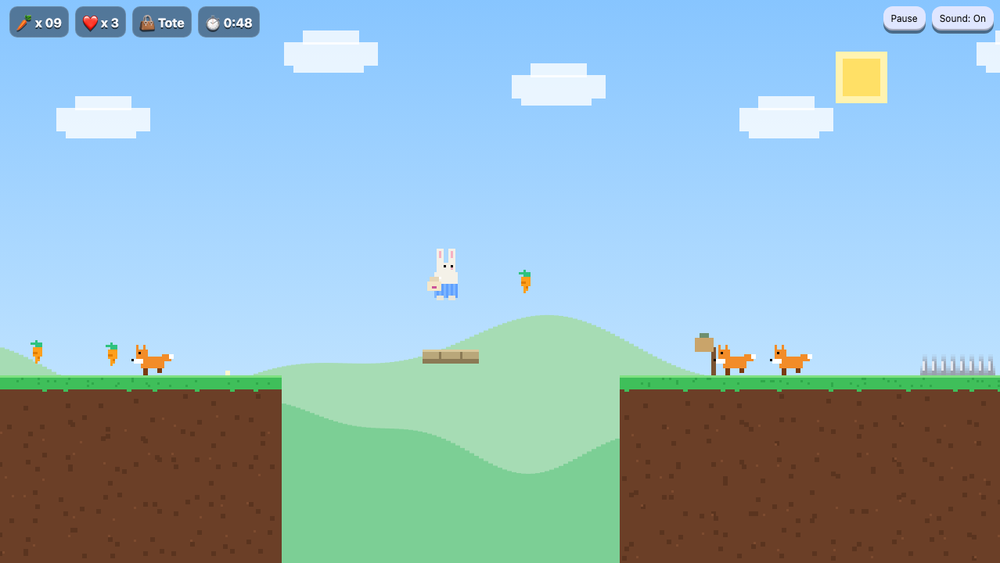
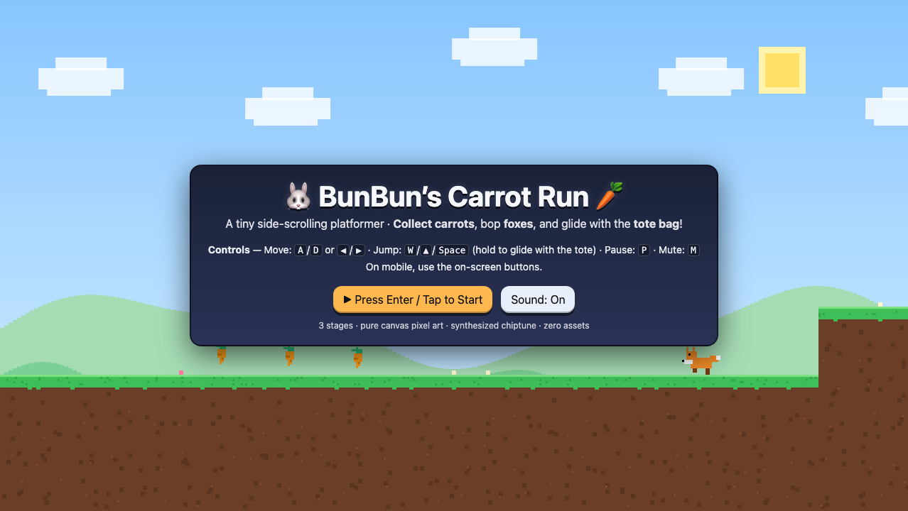
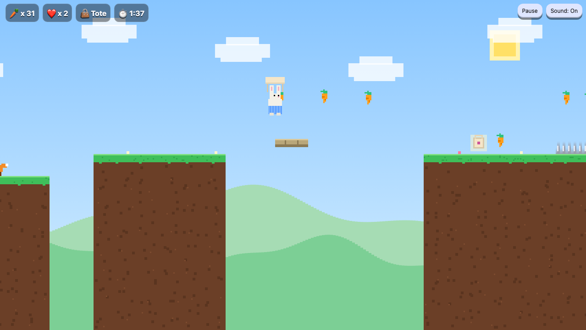

<div align="center">

# 🐰 BunBun’s Carrot Run 🥕

**A tiny pixel-art platformer that lives in a single HTML file.**
Collect carrots, bop foxes, and glide over pits with the tote bag.

[](https://mattlo0546.github.io/bun-buns-carrot-run/)




</div>

## ✨ Features

- **3 hand-built stages**: Sunny Meadow, Burrow Hills and Carrot Summit, with checkpoints along the way
- **Feels good to play**: coyote time, jump buffering, variable jump height and squash & stretch
- **Tote bag power-up**: hold jump to glide, and it absorbs one hit
- **Foxes** patrol the levels. Bop them from above and avoid them everywhere else
- **Moving platforms, spikes and pits** to keep you on your toes
- **Synthesized chiptune + SFX** made live with the Web Audio API
- **Everything is drawn in code.** There are no image or sound files
- **Keyboard and touch controls**, pause, mute, and a saved best time

<table>
  <tr>
    <td></td>
    <td></td>
  </tr>
  <tr>
    <td align="center"><sub>Title screen</sub></td>
    <td align="center"><sub>Gliding with the tote bag on Carrot Summit</sub></td>
  </tr>
</table>

## 🎮 Controls

| Action | Keyboard | Touch |
| --- | --- | --- |
| Move | <kbd>A</kbd> <kbd>D</kbd> or <kbd>←</kbd> <kbd>→</kbd> | ◀ ▶ |
| Jump | <kbd>Space</kbd> / <kbd>W</kbd> / <kbd>↑</kbd> | ▲ |
| Glide (with tote) | hold jump while falling | hold ▲ |
| Pause | <kbd>P</kbd> / <kbd>Esc</kbd> | ❚❚ |
| Mute | <kbd>M</kbd> | — |

## 🚀 Run it locally

There's nothing to build or install. Clone the repo and open the file:

```bash
git clone https://github.com/Mattlo0546/bun-buns-carrot-run.git
open bun-buns-carrot-run/index.html
```

Tip: add `?stage=2` or `?stage=3` to the URL to jump straight to a stage.

## 🛠️ Make your own levels

Levels are ASCII maps near the top of the script in [`index.html`](index.html). Edit the characters and refresh:

```
#  ground          B  stone block     ^  spikes
S  start           C  carrot          T  tote bag
F  fox             K  checkpoint      M  moving platform
G  goal
```

Physics, speeds and timings are all in the `CONFIG` object at the top of the script.

## 📄 License

[MIT](LICENSE)
